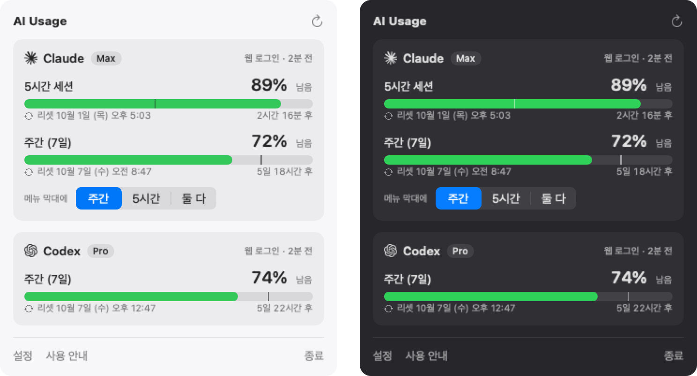

# AI Usage

Mac 메뉴 막대에서 Claude와 Codex의 남은 사용량과 초기화 시간을 확인합니다.

[English](README.md) · [한국어 사용 안내](docs/user-guide.ko.md)



## 설치와 사용

macOS 13 이상, Apple Silicon과 Intel을 지원합니다.
설치·업데이트·삭제·개인정보 처리·문제 해결은 [사용 안내](docs/user-guide.ko.md)에 정리돼 있습니다.
AI 도구가 SSH로 여러 Mac의 상태와 사용량을 읽게 하려면 [MCP 안내](docs/mcp.ko.md)를 보세요.

주의: 현재 임시 서명으로 배포합니다. 설치 검사는 파일 무결성을 확인하지만 개발자 신원을 증명하지 않습니다.
설치 전에 안내의 서명 관련 설명을 확인하세요.

## 빌드와 개발

Swift 5.9 이상 Command Line Tools와 Python 3.9 이상이 필요합니다. 저장소 루트에서 실행합니다.

```sh
make check
```

패키징은 `VERSION=0.0.0 make package`를 사용합니다. 릴리스 게시는 별도 절차입니다.
[기여 안내](CONTRIBUTING.md), [AI 작업 안내](CLAUDE.md), [의존성과 변경 영향](docs/architecture.md),
[검토 기준](docs/review.md), [변경 기록](CHANGELOG.md)을 참고하세요.

## 라이선스

[MIT](LICENSE) © 2026 Sean Woo. Anthropic·OpenAI와 제휴하지 않은 독립 프로젝트입니다.
상표와 아이콘 출처는 [사용 안내](docs/user-guide.ko.md)에 보존돼 있습니다.

AI 작업 준비도: [Swift 보완 기준과 한계](evals/swift-profile.md), [원본·보완 점수](evals/readiness-score.json).
