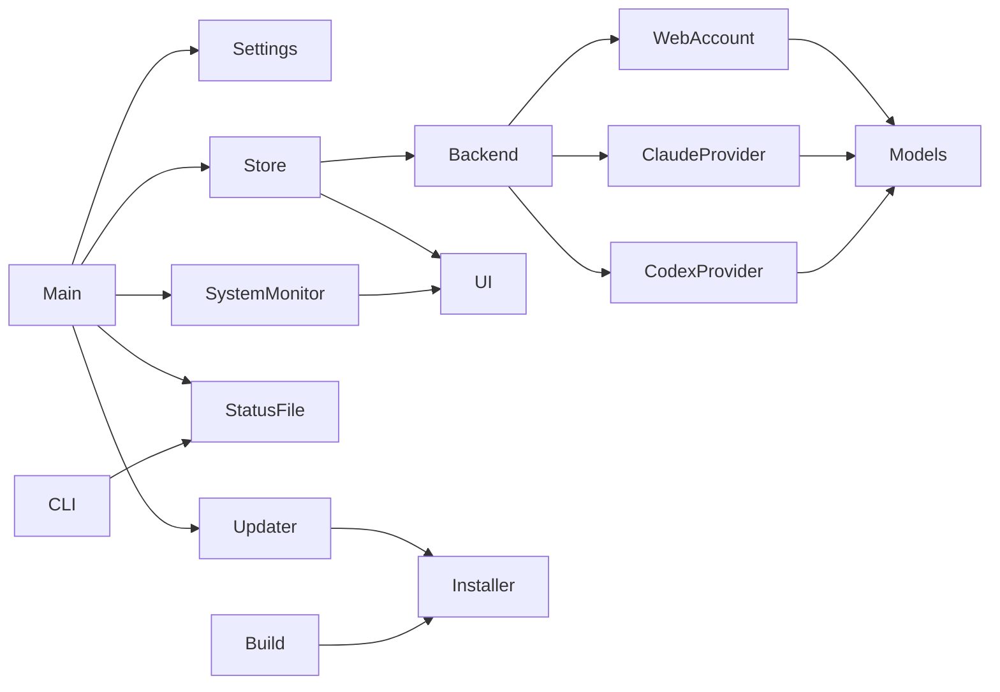

# Architecture and change impact

## Responsibility and data flow

The executable entry [main.swift](../Sources/AIUsage/main.swift) wires AppSettings, UsageStore and the menu UI.

Arrows mean uses/calls (Store publishes to UI). Build embeds Installer; Updater executes the embedded copy.
This is one Swift executable, not a JavaScript monorepo. The diagram is a reviewed index, not a generated call graph.

## Cross-module dependencies and verification

| Area / owner | Contract and consumers | Change validation |
|---|---|---|
| [Models](../Sources/AIUsage/Models.swift) | Typed usage windows, parsing bounds, retry policy; providers, Store and UI consume them | SelfTest, Regression probes, Retry-After tests |
| [Store](../Sources/AIUsage/Store.swift) | Active connection generation, cancellation, deduplication and deadlines; UI consumes published state | StoreTests, including stale responses and shuffled operations |
| [Backend](../Sources/AIUsage/Backend.swift) | External effects behind UsageBackend; StoreTests substitute fakes | StoreTests and CredentialTests; inspect all protocol conformers |
| [WebAccount](../Sources/AIUsage/WebAccount.swift) | Trust origin, shared identity-provider storage, login windows; LiveBackend consumes | OriginTests, login state tests; manual live-login smoke check remains separate |
| [CodexProvider](../Sources/AIUsage/CodexProvider.swift) / [ClaudeProvider](../Sources/AIUsage/ClaudeProvider.swift) | Parse remote data, read CLI credentials; do not mutate CLI ownership | Synthetic parser/log fixtures and CredentialTests |
| [PopoverView](../Sources/AIUsage/PopoverView.swift) / [StatusImage](../Sources/AIUsage/StatusImage.swift) | Display Store data and user actions, bilingual copy | SelfTest and manual light/dark, Korean/English visual review |
| [SystemMonitor](../Sources/AIUsage/SystemMonitor.swift) / [SystemDetails](../Sources/AIUsage/SystemDetails.swift) / [SystemDetailView](../Sources/AIUsage/SystemDetailView.swift) | Local CPU, memory, disk and network readings, strain levels and detail popovers; Main draws one status item per metric. Process lists only while a popover is open | SystemTests, crash probes, `--render-details` off-screen render; app CPU use stays near idle |
| [StatusSnapshot](../Sources/AIUsage/StatusSnapshot.swift) / [StatusCLI](../Sources/AIUsage/StatusCLI.swift) | Saved status file (schema v1, 0600) written by Main; read-only `status`/`top`/`mcp` commands consume it or measure live. External AI tools depend on the JSON keys and tool names | StatusTests; real MCP session locally and over SSH before release |
| [Updater](../Sources/AIUsage/Updater.swift) | Parse release and invoke bundled installer; packaging must keep script available | UpdaterTests, isolated installer suite; signed distribution smoke checks at release |
| [LoginItem](../Sources/AIUsage/LoginItem.swift) | Enable only for installed app paths | SelfTest startup/location cases; installed-app manual check |
| [Build](../scripts/build-app.sh) / [Installer](../scripts/install.sh) | Fixed identity, pinned version, integrity checks, replacement and rollback | Installer fixtures, universal packaging at release |

## Workflow

Before editing, select the affected row and its direct consumers. Search callers of any changed public symbol.
Run `make check` for code changes. Update the row if ownership, dependencies or verification change.
Do not remove manual checks just because unit tests pass: WebKit login, UI and notarization need separate evidence.

## Why / decisions

See [identity, credentials and updates](decisions/README.md), [test contracts](../Tests/AGENTS.md),
[review checklist](review.md) and [release operations](release-and-operations.md).
