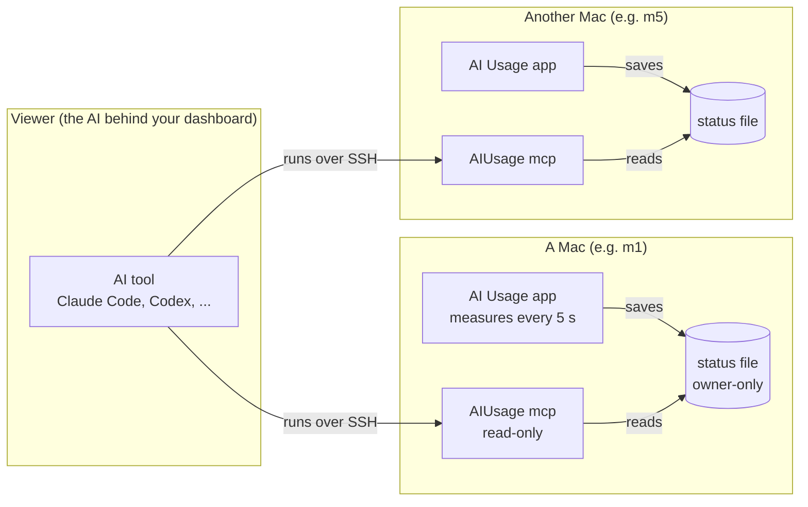

# AI Usage MCP guide

How AI tools read the status of a Mac running AI Usage. Add one entry per Mac to your AI tool, and it can ask
each Mac for CPU, memory, disk, network and Claude/Codex usage.

[한국어](mcp.ko.md) · [Back to the user guide](user-guide.md)

MCP (Model Context Protocol, a standard way for AI tools to call external tools) is supported by
Claude Code, the Claude desktop app, Codex and many others.

## How it fits together



- **The app on each Mac** measures only that Mac every 5 seconds and saves the result to a file. It sends nothing to other Macs or the internet.
- **The AI tool** connects to each Mac over SSH, runs `AIUsage mcp`, and asks it for values.
- Nothing listens on the network. Who can read a Mac is decided by the SSH access you already control.
- Combining several Macs on one screen and sending alerts is the AI tool's job.

## On each Mac

1. **Install AI Usage 1.5.0 or later** with the one-line command in the [user guide](user-guide.md).
2. **Keep the app running**: turn on "Launch at login" in Settings so it keeps saving after a restart.
3. **Status saving on**: Settings → "Save this Mac's status for other AI tools" (on by default).
4. **Remote Login on**: System Settings → General → Sharing → Remote Login, the built-in SSH server.
5. **For Claude/Codex usage**, connect them in that Mac's AI Usage. Without it you get system values only.

A Mac without a monitor needs this once over Screen Sharing; after that it never needs a screen.

## Connect your AI tool

The viewing computer must reach each Mac over SSH without a password prompt (SSH keys). Below, `m1` is a host
in `~/.ssh/config` and `mac-m1` is the name inside the AI tool. Add one per Mac.

<details>
<summary><b>Claude Code</b></summary>

```bash
claude mcp add --scope user mac-m1 -- ssh -o BatchMode=yes m1 "'/Applications/AI Usage.app/Contents/MacOS/AIUsage'" mcp
```

Check with `claude mcp list`.
</details>

<details>
<summary><b>Codex</b></summary>

```bash
codex mcp add mac-m1 -- ssh -o BatchMode=yes m1 "'/Applications/AI Usage.app/Contents/MacOS/AIUsage'" mcp
```

Or in `~/.codex/config.toml`:

```toml
[mcp_servers.mac-m1]
command = "ssh"
args = ["-o", "BatchMode=yes", "m1", "'/Applications/AI Usage.app/Contents/MacOS/AIUsage'", "mcp"]
```
</details>

<details>
<summary><b>Claude desktop app and other JSON-configured tools</b></summary>

```json
{
  "mcpServers": {
    "mac-m1": {
      "command": "ssh",
      "args": ["-o", "BatchMode=yes", "m1", "'/Applications/AI Usage.app/Contents/MacOS/AIUsage'", "mcp"]
    }
  }
}
```
</details>

The app path contains spaces, so it is wrapped in single quotes for the remote shell. `BatchMode=yes` makes SSH
fail at once instead of waiting for a password, so the AI tool doesn't hang. For the Mac the AI tool runs on,
use the executable path and `mcp` directly, without SSH.

## Tools

All three are read-only. They never change settings, stop processes or go online.

| Tool | What it returns | Input |
|---|---|---|
| `get_status` | Host info, CPU/memory/disk/network with levels, Claude/Codex usage | `include_history` (boolean, default false): add the last 2 minutes of samples |
| `get_ai_usage` | Claude/Codex usage only | none |
| `get_top_processes` | Busiest processes | `by`: `cpu`, `memory`, `disk` or `network` (default cpu); `limit`: 1 to 30 (default 10) |

Results are JSON text. The disk process list is measured over one second, and the network list over about five seconds (with the built-in `nettop`), so they take a moment.

### Levels

`level` is `normal`, `warning` or `critical`, the same rule as the menu bar colours.

| Metric | Warning | Critical | Based on |
|---|---|---|---|
| CPU | 70% or more | 90% or more | 5-second average, so brief spikes don't flap |
| Memory | under 20% free | under 10% free, or macOS reports critical pressure | Free share as macOS computes memory pressure. High usage from cache is normal |
| Disk | 90% used or more | 95% used or more | Startup disk |
| GPU | 70% or more | 90% or more | Current GPU utilisation |
| Internet (`network.internet.level`) | The main connection is down but another works, a connection shows a login page, or responds in 500 ms or more | Nothing reaches the internet | Each connection tested separately (when turned on) |
| Temperature (`sensors.level`) | 85 °C or more | 95 °C or more | Hottest CPU die sensor. Apple Silicon slows itself down near 95 °C |
| SSD health (`drives[].level`) | 80% of rated life used, or any media error | Drive reports a critical warning, spare space below its threshold, or 100% life used | The drive's own SMART report |

`usage_percent` is the latest one-second value and `level` uses the 5-second average, so they can briefly disagree.

### Fields

<details>
<summary>Example get_status result and field notes</summary>

```json
{
  "schema_version": 1,
  "generated_at": "2026-10-03T13:45:10Z",
  "source": "app",
  "app_version": "1.5.0",
  "host": { "name": "office-mac", "chip": "Apple M4", "model": "Mac16,10", "macos_version": "26.0.0",
            "cpu_cores": 10, "performance_cores": 4, "efficiency_cores": 6,
            "memory_bytes": 25769803776, "uptime_seconds": 27550 },
  "system": {
    "cpu": { "usage_percent": 23.1, "level": "normal", "user_percent": 15.2, "system_percent": 7.9,
             "idle_percent": 76.9, "cores_percent": [41.0, 38.5, 12.0], "load_average": [3.1, 2.9, 2.7] },
    "memory": { "used_percent": 78.5, "level": "normal", "total_bytes": 25769803776, "used_bytes": 20229341184,
                "app_bytes": 8053063680, "wired_bytes": 2576980378, "compressed_bytes": 9599298150,
                "cached_bytes": 4187593113, "free_bytes": 5540462592, "pressure_free_percent": 50,
                "swap_used_bytes": 0, "swap_total_bytes": 0 },
    "disk": { "used_percent": 67.2, "level": "normal", "total_bytes": 994662584320, "free_bytes": 326417514496,
              "read_bytes_per_second": 1048576, "write_bytes_per_second": 524288,
              "read_since_boot_bytes": 114890000000, "written_since_boot_bytes": 23620000000 },
    "network": { "download_bytes_per_second": 25600, "upload_bytes_per_second": 47104,
                 "received_since_boot_bytes": 1503238553, "sent_since_boot_bytes": 573571072,
                 "interface": "Ethernet", "local_ip": "192.168.0.10" }
  },
  "ai_usage": [
    { "provider": "claude", "account_key": "0f3a9c51d2e47b86", "connection": "cli", "plan": "max", "fetched_at": "2026-10-03T13:44:02Z",
      "windows": [
        { "kind": "session_5h", "label": "5-hour session", "used_percent": 19, "remaining_percent": 81,
          "resets_at": "2026-10-03T17:30:00Z", "window_minutes": 300 },
        { "kind": "weekly", "label": "Weekly (7 days)", "used_percent": 23, "remaining_percent": 77,
          "resets_at": "2026-10-04T10:00:00Z", "window_minutes": 10080 } ] }
  ]
}
```

- `source`: `app` means the app saved it within the last 30 seconds. `live` means the app isn't running, so system values were measured on the spot and `ai_usage` is the last saved value (see `fetched_at`).
- `ai_usage`: connected services only; `null` if this Mac has never saved any. `error` explains a failed read.
- `account_key`: a one-way label of the account (16 hex characters made from the service's account or organization ID with SHA-256). The same account gives the same label on every Mac, whether connected on the web or through the CLI. The ID itself is never included and can't be recovered from the label.
- `kind`: `session_5h`, `weekly`, `weekly_model` (one model's weekly limit) or `other`. `label` is in that Mac's language.
- A window whose reset time has passed shows 0% used and no reset time, as in the app.
- Times are UTC in ISO 8601 (`2026-10-03T13:45:10Z`).
- Sizes are bytes, speeds bytes per second, percentages 0 to 100 rounded to one decimal.
- With `include_history`, `system.history` holds samples every `interval_seconds` (1 s when the Mac shows system items in its menu bar, otherwise 5 s): CPU, memory, disk read/write, download/upload.
- Hardware sections (added in 1.6.0) appear only when the Mac has them:
  - `system.cpu.core_types`: the core group of each entry in `cores_percent` (`efficiency`, `performance`, `super`, ... as macOS names them), and `core_groups`: `kind`, `count`, `usage_percent` per group, fastest first (Apple Silicon).
  - `system.gpu`: `model`, `cores`, `utilization_percent`, `renderer_percent`, `tiler_percent`, `memory_in_use_bytes`, `level`.
  - `system.sensors`: `cpu_average_c`, `cpu_max_c`, `ssd_c`, `battery_c`, `fans` (`rpm`, `min_rpm`, `max_rpm`), `system_power_watts`, `level`, and every sensor in `temperatures`.
  - `system.drives`: SSD health per drive: `percentage_used` (of rated life), `available_spare_percent`, `temperature_c`, `power_on_hours`, `power_cycles`, `unsafe_shutdowns`, `media_errors`, lifetime `data_read_bytes` / `data_written_bytes`, `level`.
  - `system.volumes`: every mounted disk with `total_bytes`, `free_bytes`, `used_percent`, `file_system`, `is_internal`, `is_removable`, `is_startup`.
  - `system.wifi`: `interface`, `rssi_dbm` (signal), `noise_dbm`, `channel`, `band_ghz`, `transmit_rate_mbps`. The network name (SSID) is not included: it needs Location permission and anyone nearby can choose it.
  - `system.network.internet` (1.7.0): `state` (`ok`, `degraded` = the main connection is down but another works, `offline`, `not_checked`), `level`, `check_enabled`, and `connections`: each wired (`ethernet`) and `wifi` connection with `name`, `interface`, `connected`, `ipv4`, `is_primary` (carries the default route), `internet` (`ok`, `no_internet`, `captive_portal` = a login page answered, `not_checked`), `latency_ms`, `checked_at`, `level`. The check runs every minute only when turned on in Settings.
  - `system.battery` (laptops): `percent`, `charging`, `plugged_in`, `minutes_remaining`, `cycle_count`, `health_percent`, `temperature_c`.
- `schema_version` changes only when an existing field changes meaning or name. New fields may appear within the same version.
</details>

### Several Macs on one account

If several Macs use the same Claude or Codex account, their usage entries are identical. Entries with the same
`provider` and `account_key` are one account: show them once, preferably the one with the latest `fetched_at`.
Different labels mean different accounts, so this keeps working if the Macs later use separate accounts.
The MCP server says the same to AI clients in its instructions.

## Reading it yourself

The same data is available in a terminal. Try this first when an MCP connection fails.

<details>
<summary>Commands</summary>

```bash
# This Mac
"/Applications/AI Usage.app/Contents/MacOS/AIUsage" status          # summary
"/Applications/AI Usage.app/Contents/MacOS/AIUsage" status --json   # everything (add --history for samples)
"/Applications/AI Usage.app/Contents/MacOS/AIUsage" top memory      # cpu, memory or disk

# Another Mac
ssh m1 "'/Applications/AI Usage.app/Contents/MacOS/AIUsage' status"
```
</details>

## Security

- **Nothing listens.** The MCP server runs only while an AI tool's SSH session is open and exits when it ends.
- **Read-only.** All three tools only read.
- **No secrets.** The status file and results never contain tokens, cookies, passwords, e-mail addresses or account IDs (only the one-way `account_key`). The file is readable by your account only (mode 0600).
- **Internet check** (off by default): when turned on, every minute each connection fetches Apple's connectivity page (`captive.apple.com`, the server macOS itself uses for the same purpose). Nothing else is sent.
- **Temperatures, fans and power** use private but long-stable macOS interfaces (the same ones Stats uses). They only read; no admin rights or helper tool. If a macOS update changes them, those values are just missing.
- **Names are untrusted.** Any program chooses its own process name, and whoever names a USB drive or device chooses those names, so they are cut to one line, stripped of invisible characters and limited to 64 characters, and AI clients are told that reported text is data, never instructions.
- Don't want the file? Turn status saving off in Settings; the saved file is deleted too.

## Troubleshooting

| Symptom | Check |
|---|---|
| The AI tool can't connect | `ssh -o BatchMode=yes m1 true` must finish without a password prompt. For a new Mac, connect once with `ssh m1` to accept its host key |
| `No such file or directory` | AI Usage 1.5.0 or later is installed in `/Applications` on that Mac |
| `source` stays `live` | The app isn't running there, or status saving is off. Start it and turn on "Launch at login" |
| `ai_usage` is `null` or empty | Claude/Codex aren't connected in that Mac's AI Usage |
| `ai_usage` has an `error` | Follow the hint shown in that Mac's AI Usage (for example, log in again) |
