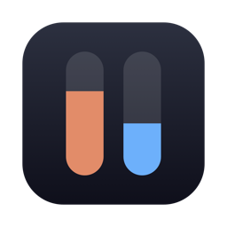

<p align="center">
  
</p>

<h1 align="center">AI Usage</h1>

<p align="center">
  Claude와 Codex를 얼마나 더 쓸 수 있는지, 언제 다시 채워지는지 Mac 메뉴 막대에서 바로 보여 줍니다.
</p>

<p align="center">
  <a href="https://github.com/seanwoo-personal/ai-usage/releases/latest"></a>
  
  
  <a href="../LICENSE"></a>
</p>

<p align="center">
  <a href="user-guide.md">English</a> · 한국어
</p>

<p align="center">
  
</p>

<p align="center">
  
</p>

## 기능

- **한눈에 보기**: 서비스마다 윗줄에 리셋까지 남은 시간(`5d 18h` = 5일 18시간), 아랫줄에 남은 사용량(`72%`)을 보여 줍니다.
- **Claude와 Codex**: 5시간 세션 한도와 주간 한도, 요금제에 있으면 모델별 주간 한도까지 보여 줍니다.
- **균등 사용 기준선**: 막대 위 눈금은 고르게 썼다면 지금 남아 있어야 할 위치입니다. 막대가 더 길면 여유가 있다는 뜻입니다.
- **두 가지 연결 방법**: 앱 안에서 claude.ai·chatgpt.com에 로그인하거나, 이 Mac의 Claude Code·Codex CLI 로그인을 그대로 씁니다.
- **문제가 생기면 바로 안내**: 문제마다 이유 한 문장과 해결 버튼 하나(다시 로그인, 다시 시도)를 보여 주고, 마지막 값은 그대로 둡니다.
- **요청 제한 존중**: 서버가 기다려 달라고 하면 그 시각까지 다시 요청하지 않습니다.
- **자동 업데이트**: 하루 한 번 새 버전을 확인하고, 버튼 하나로 처음 설치할 때와 같은 검증을 거쳐 업데이트합니다.
- **AI 도구가 읽을 수 있음**: 앱에 읽기 전용 `status` 명령과 MCP 서버가 들어 있어, AI가 SSH로 여러 Mac을 볼 수 있습니다. [아래](#ai-도구스크립트에서-읽기-mcp)를 참고하세요.
- **시스템 상태도 함께 (선택)**: CPU·RAM·SSD·네트워크 속도를 메뉴 막대의 별도 항목으로 보여 줍니다. [Stats](https://github.com/exelban/stats)와 같은 방식으로 계산합니다. 각 항목을 누르면 최근 그래프, 세부 사용량, 많이 쓰는 프로세스를 볼 수 있습니다. CPU·RAM·SSD는 상태가 나쁘면 노랑·빨강으로 바뀝니다. 기본은 꺼져 있습니다.
- **가볍고 사적**: 계정 가입, 분석 도구, 개발자 서버가 없습니다.

## 설치 (1분)

**1. 터미널을 엽니다.** `⌘ Command` + `Space`를 누르고 `터미널`을 입력한 뒤 `Enter`를 누릅니다.

**2. 아래 명령을 복사해 붙여넣고 `Enter`를 누릅니다.** 상자 오른쪽 위의 복사 버튼을 누르면 한 번에 복사됩니다.

```bash
curl -fsSL https://raw.githubusercontent.com/seanwoo-personal/ai-usage/main/scripts/install.sh | bash
```

**3. 열리는 안내 창에서 Claude와 ChatGPT 계정을 연결합니다.** 평소 쓰는 계정으로 한 번만 로그인하면 됩니다.

> [!NOTE]
> 아직 Apple 개발자 인증(서명·공증)을 받지 않은 앱입니다. 설치 스크립트는 정확한 릴리스 버전을 고정하고,
> 해시(파일 지문)와 앱 서명의 무결성을 확인한 다음에만 앱을 교체하며, 문제가 있으면 기존 앱으로 되돌립니다.
> 이는 파일이 손상되거나 바뀌지 않았다는 확인이지, 만든 사람을 Apple이 보증한다는 뜻은 아닙니다.
> 이 방법은 macOS 경고 창 없이 설치되고, 아래 DMG 방법은 경고 창을 거칩니다.

<details>
<summary>터미널 대신 DMG 파일로 설치하기</summary>

1. [최신 릴리스](https://github.com/seanwoo-personal/ai-usage/releases/latest)에서 `AI-Usage-<버전>.dmg`를 내려받아 엽니다.
2. **AI Usage**를 **Applications** 폴더로 끌어다 놓습니다. DMG 창에서 바로 실행하지 마세요.
3. 앱을 열면 경고 창이 뜹니다. **반드시 [완료]를 누르세요.** [휴지통으로 이동]을 누르면 앱이 지워집니다.
4. **시스템 설정 → 개인정보 보호 및 보안**을 열고 맨 아래 **[그래도 열기]**를 누릅니다.

</details>

**필요한 것:** macOS 13(Ventura) 이상, Apple Silicon 또는 Intel. Claude 한도는 Pro·Max 요금제, Codex 한도는 ChatGPT 유료 요금제가 필요합니다.

## 업데이트

앱이 하루에 한 번 새 버전을 확인합니다. 새 버전이 있으면 메뉴 맨 위에 **[업데이트]**가 보이고, 누르면 새 버전으로 다시 열립니다. 설정에서 자동 확인을 끌 수 있습니다.

설치 명령을 다시 실행해도 최신 버전으로 바뀝니다. 연결한 계정과 설정은 그대로 유지됩니다.

## 삭제

1. AI Usage 설정에서 **"Mac에 로그인하면 자동으로 실행"**을 끕니다. 켜 둔 채 지우면 로그인 항목에 빈 항목이 남습니다.
2. 앱을 종료하고 지웁니다.

```bash
osascript -e 'quit app "AI Usage"'; rm -rf "/Applications/AI Usage.app"
```

설정과 앱에 저장된 웹 로그인까지 지우려면 이어서 실행합니다.

```bash
rm -rf ~/Library/Preferences/com.sean.aiusage.plist ~/Library/Caches/com.sean.aiusage ~/Library/HTTPStorages/com.sean.aiusage ~/Library/HTTPStorages/com.sean.aiusage.binarycookies ~/Library/WebKit/com.sean.aiusage
```

## AI 도구·스크립트에서 읽기 (MCP)

앱은 5초마다 이 Mac의 상태를 본인만 읽을 수 있는 파일
(`~/Library/Application Support/AI Usage/status.json`)에 저장합니다. CPU·메모리·디스크·네트워크와
정상/주의/위험 단계, 최근 2분 기록, Claude/Codex 사용량이 들어가며 토큰·쿠키·계정 정보는 넣지 않습니다.
설정의 **다른 AI·도구가 이 Mac 상태를 읽을 수 있게 저장**에서 끌 수 있습니다.

앱 실행 파일에는 읽기 전용 명령이 들어 있습니다.

```bash
"/Applications/AI Usage.app/Contents/MacOS/AIUsage" status          # 요약. --json을 붙이면 전체
"/Applications/AI Usage.app/Contents/MacOS/AIUsage" top memory      # 많이 쓰는 프로세스: cpu, memory, disk
"/Applications/AI Usage.app/Contents/MacOS/AIUsage" mcp             # MCP 서버(표준 입출력)
```

앱이 꺼져 있으면 시스템 수치는 그 자리에서 재고, Claude/Codex 사용량은 마지막으로 저장된 값을 돌려줍니다.

**여러 Mac 보기.** 네트워크로 열어 두는 것은 없습니다. AI 도구가 SSH로 들어가 MCP 서버를 실행합니다.
Mac마다 한 줄씩 추가합니다(원격 로그인이 켜져 있어야 하고, Tailscale과 함께 쓰면 편합니다). MCP 설정 예:

```json
{
  "mcpServers": {
    "mac-office": {
      "command": "ssh",
      "args": ["-o", "BatchMode=yes", "office-mac", "'/Applications/AI Usage.app/Contents/MacOS/AIUsage'", "mcp"]
    }
  }
}
```

도구: `get_status`(전체 요약, `include_history`로 그래프 기록 포함), `get_ai_usage`,
`get_top_processes`(`by`: cpu·memory·disk, `limit` 1~30). 모두 읽기 전용입니다.

## 개인정보와 보안

- **남기는 건 사용량 숫자뿐입니다.** 남은 사용량과 리셋 시각만 저장하고, 대화 내용·파일·결제 정보는 저장하거나 보내지 않습니다.
- **개발자 서버가 없습니다.** 로그인 정보는 Anthropic·OpenAI 공식 서버(claude.ai, api.anthropic.com, chatgpt.com)에 로그인하고 사용량을 물어볼 때만 쓰입니다.
- **비밀번호는 공식 로그인 페이지에 직접 입력됩니다.** 앱은 읽거나 저장하지 않습니다. 로그인 창은 지금 주소가 공식 사이트인지, Google·Apple·Microsoft 로그인 단계인지, 그 밖의 사이트인지 알려 줍니다.
- **CLI 로그인은 읽기만 합니다.** Claude Code의 키체인 항목과 Codex의 `auth.json`은 읽기만 합니다. Codex 서버 조회가 안 될 때는 대화 기록 파일(`~/.codex/sessions`)의 끝부분을 읽어 사용량 숫자만 꺼냅니다.
- **연결 해제**: 앱 안에 저장된 그 서비스의 로그인이 지워집니다. Google·Apple 로그인 상태는 두 서비스가 함께 쓰므로 웹으로 연결된 서비스를 모두 해제할 때 지워집니다. Claude Code·Codex 자체의 로그인은 건드리지 않습니다.
- **시스템 상태**(켠 경우): 이 Mac의 CPU·메모리·디스크·네트워크 수치를 Mac 안에서만 읽고, 어디로도 보내지 않습니다. 세부 창의 프로세스 목록은 창이 열려 있을 때만 읽습니다.
- **상태 저장**(`AIUsage status`·`mcp`용): 본인 계정만 읽을 수 있는 파일에만 저장하고, 네트워크로 열어 두지 않습니다. 다른 Mac은 이미 허용한 SSH 접속으로만 읽을 수 있습니다.
- **업데이트 확인**: 하루 한 번 GitHub(`api.github.com`)에 접속합니다. 설정에서 끌 수 있습니다.

보안 문제를 발견하셨다면 공개 이슈 대신 비공개로 알려 주세요. [SECURITY.md](../SECURITY.md)를 참고하세요.

## 자주 묻는 질문

<details>
<summary>로그인 창에서 Google 로그인이 막혀요</summary>

Google이 앱 안 로그인을 막는 경우가 있습니다. 같은 화면에서 **이메일로 계속하기**(또는 Apple)를 이용해 주세요.
</details>

<details>
<summary>숫자가 안 바뀌거나 "!"가 보여요</summary>

메뉴 막대 아이콘을 누르면 이유와 해결 버튼이 카드에 나옵니다. `⌘R`로 바로 새로고침할 수 있습니다. 서버가 기다려 달라고 한 경우에는 언제 다시 불러오는지 보여 줍니다.
</details>

<details>
<summary>얼마나 자주 새로 받아오나요?</summary>

기본 3분마다(설정에서 1~15분), 메뉴를 열 때, Mac이 잠자기에서 깨어날 때 받아옵니다. 리셋까지 남은 시간은 서버에 묻지 않고 계속 줄어듭니다.
</details>

<details>
<summary>"Mac에 로그인하면 자동으로 실행"이 안 켜져요</summary>

응용 프로그램 폴더에 있는 앱에서만 켤 수 있습니다. 앱을 그곳으로 옮긴 뒤 다시 켜 주세요.
</details>

## 직접 빌드하기

Xcode Command Line Tools(Swift 5.9 이상)만 있으면 됩니다. Xcode는 필요 없습니다.

```bash
./scripts/selftest.sh                     # 앱 테스트 + 설치 스크립트 격리 테스트
VERSION=1.2.1 ./scripts/build-app.sh      # dist/ 에 유니버설 앱, ZIP(+ .sha256), DMG
```

동작 방식은 [영문 README](../README.md#building-from-source)의 "How it works"를 참고하세요.

## 기여

이슈와 풀 리퀘스트를 환영합니다. [CONTRIBUTING.md](../CONTRIBUTING.md)를 참고하세요. 버전별 변경 사항은 [CHANGELOG.md](../CHANGELOG.md)에 있습니다.

## 라이선스

[MIT](../LICENSE) © 2026 Sean Woo

시스템 상태 계산 방식은 Serhiy Mytrovtsiy의 [Stats](https://github.com/exelban/stats)(MIT)를 참고했습니다.

AI Usage는 개인이 만든 독립 프로젝트이며 Anthropic, OpenAI와 제휴하거나 후원·보증을 받지 않습니다. Claude, Claude Code, Codex, ChatGPT와 각 로고는 해당 회사의 상표이며, 로고 경로는 [Simple Icons](https://simpleicons.org)(CC0)에서 가져왔습니다.
