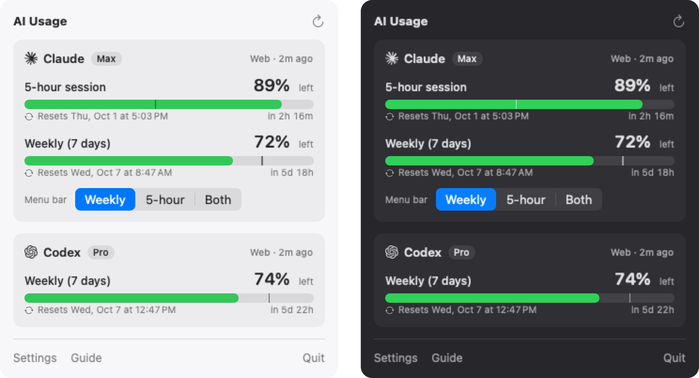

<p align="center">
  
</p>

<h1 align="center">AI Usage</h1>

<p align="center">
  See how much Claude and Codex you have left, and when it resets, right in your Mac's menu bar.
</p>

<p align="center">
  <a href="https://github.com/seanwoo-personal/ai-usage/releases/latest"></a>
  
  
  <a href="../LICENSE"></a>
</p>

<p align="center">
  English · <a href="user-guide.ko.md">한국어</a>
</p>

<p align="center">
  
</p>

<p align="center">
  
</p>

## Features

- **At a glance**: each service shows time until reset on top (`5d 18h`) and what's left below (`72%`).
- **Claude and Codex**: the 5-hour session limit, the weekly limit, and per-model weekly limits when your plan has them.
- **Pace marker**: a tick on each bar shows where you'd be if you spread usage evenly; ahead of it means you have room.
- **Two ways to connect**: log in to claude.ai / chatgpt.com inside the app, or reuse the Claude Code / Codex CLI login already on your Mac.
- **Clear when something's wrong**: every problem comes with one sentence and one button (log in again, try again). Last known values stay visible.
- **Respects rate limits**: honours the server's `Retry-After` and never hammers the API.
- **Updates itself**: checks once a day; one click installs the new version with the same checks as a fresh install.
- **System status too (optional)**: CPU, RAM, SSD and network speed in a second menu bar item, measured the same way as [Stats](https://github.com/exelban/stats). Off by default.
- **Small and private**: no account, no analytics, no server of its own.

## Install

Open **Terminal** (`⌘ Space`, type `Terminal`, `Enter`), paste this line and press `Enter`:

```bash
curl -fsSL https://raw.githubusercontent.com/seanwoo-personal/ai-usage/main/scripts/install.sh | bash
```

The app opens with a short guide to connect your Claude and ChatGPT accounts.

> [!NOTE]
> AI Usage is not yet signed with an Apple Developer ID or notarized. The installer pins an exact release, checks its
> SHA-256 and the app's code-signature integrity, and only then replaces the app (rolling back on any failure).
> That proves the files weren't corrupted or altered after signing. It does not prove who built them.
> Installing this way skips the Gatekeeper prompt; the DMG below goes through it.

<details>
<summary>Install from the DMG instead</summary>

1. Download `AI-Usage-<version>.dmg` from the [latest release](https://github.com/seanwoo-personal/ai-usage/releases/latest).
2. Drag **AI Usage** into **Applications** (don't run it from the disk image).
3. Open it. macOS will say it can't verify the developer. Click **Done**, not *Move to Trash*.
4. Open **System Settings → Privacy & Security**, scroll down and click **Open Anyway**.

</details>

**Requirements:** macOS 13 Ventura or later, Apple Silicon or Intel. Claude limits need a Pro or Max plan; Codex limits need a paid ChatGPT plan.

## Update

AI Usage checks for a new version once a day. When one is out, the top of the menu shows **Update**. Click it and the app reopens on the new version. You can turn the daily check off in Settings.

Running the install command again also updates to the latest release. Your connections and settings are kept.

## Uninstall

1. In AI Usage → Settings, turn off **Open at login** (otherwise an empty login item is left behind).
2. Quit and remove the app:

```bash
osascript -e 'quit app "AI Usage"'; rm -rf "/Applications/AI Usage.app"
```

To also remove its settings and saved web logins:

```bash
rm -rf ~/Library/Preferences/com.sean.aiusage.plist ~/Library/Caches/com.sean.aiusage ~/Library/HTTPStorages/com.sean.aiusage ~/Library/HTTPStorages/com.sean.aiusage.binarycookies ~/Library/WebKit/com.sean.aiusage
```

## Privacy and security

- **Only usage numbers are kept**: remaining percentage and reset times. Conversations, files and billing details are never stored or sent.
- **No developer server.** Your login is used only with Anthropic's and OpenAI's own servers (claude.ai, api.anthropic.com, chatgpt.com), to sign in and ask for usage.
- **Passwords go straight to the official login page.** The app never reads or stores them. The login window tells you whether you're on the service itself, a sign-in step (Google, Apple, Microsoft), or somewhere else.
- **CLI logins are read, never changed.** Claude Code's Keychain item and Codex's `auth.json` are only read. If Codex's live check fails, the app reads the end of Codex's session logs (`~/.codex/sessions`) and extracts the usage figures only.
- **Disconnecting** erases that service's login stored in the app. Google/Apple sign-in data is shared by both services and is erased once no service is connected through the web. Claude Code's and Codex's own logins are never touched.
- **System section** (if you turn it on) reads this Mac's CPU, memory, disk and network counters locally; nothing is sent anywhere.
- **Update checks** contact GitHub (`api.github.com`) once a day; you can turn this off.

Found a security issue? Please report it privately; see [SECURITY.md](../SECURITY.md).

## FAQ

<details>
<summary>Google sign-in is blocked in the login window</summary>

Google sometimes refuses sign-in inside apps. Use **Continue with email** (or Apple) on the same page.
</details>

<details>
<summary>The numbers don't change, or I see "!"</summary>

Click the menu bar item: the card explains what happened and offers a fix. `⌘R` refreshes immediately (unless the server asked to wait, in which case the card shows until when).
</details>

<details>
<summary>How often does it refresh?</summary>

Every 3 minutes by default (1 to 15 in Settings), when you open the menu, and after the Mac wakes. The countdown keeps ticking without asking the server.
</details>

<details>
<summary>"Open at login" won't turn on</summary>

It only works for the copy in your Applications folder. Move the app there and try again.
</details>

## Building from source

Requires the Xcode Command Line Tools (Swift 5.9+). Xcode itself is not needed.

```bash
./scripts/selftest.sh                     # app tests + isolated installer tests
VERSION=1.2.1 ./scripts/build-app.sh      # universal app, ZIP (+ .sha256) and DMG in dist/
```

<details>
<summary>How it works</summary>

| | Web login (default) | CLI login (optional) |
|---|---|---|
| Claude | claude.ai session in the app → `claude.ai/api/organizations/{org}/usage` | Claude Code Keychain token → `api.anthropic.com/api/oauth/usage` |
| Codex | chatgpt.com session in the app → `chatgpt.com/backend-api/wham/usage` | `~/.codex/auth.json` → same endpoint, falling back to `~/.codex/sessions` |

Web sessions live in the app's own WebKit store, and usage is fetched from inside the logged-in page, so the app's code never handles cookies or tokens. These are the services' internal endpoints, not public APIs, so a site change can break them.

`SIGN_IDENTITY` and `NOTARY_PROFILE` enable Developer ID signing and notarization in `build-app.sh` (not exercised yet). The bundle ID is fixed to `com.sean.aiusage`.
</details>

## Contributing

Issues and pull requests are welcome; see [CONTRIBUTING.md](../CONTRIBUTING.md). Release history is in [CHANGELOG.md](../CHANGELOG.md).

## License

[MIT](../LICENSE) © 2026 Sean Woo

The system section's measurements follow [Stats](https://github.com/exelban/stats) by Serhiy Mytrovtsiy (MIT).

AI Usage is an independent project and is not affiliated with, endorsed by, or sponsored by Anthropic or OpenAI. Claude, Claude Code, Codex, ChatGPT and their logos are trademarks of their respective owners; logo paths come from [Simple Icons](https://simpleicons.org) (CC0).
